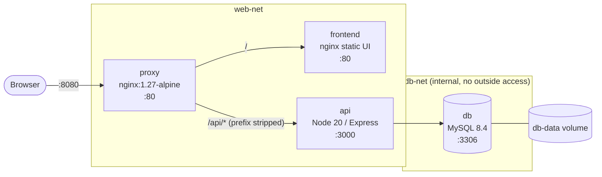
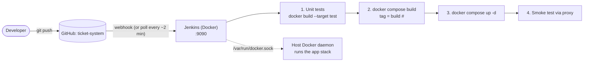

# Architecture

## Services

| Service  | Image / build            | Port (host) | Networks        | Healthcheck                      |
|----------|--------------------------|-------------|-----------------|----------------------------------|
| proxy    | `./proxy` (nginx 1.27)   | **8080**    | web-net         | `GET /nginx-health`              |
| frontend | `./frontend` (nginx 1.27)| none        | web-net         | `GET /`                          |
| api      | `./api` (target `production`) | none   | web-net, db-net | `GET /health`                    |
| db       | `./db` (mysql 8.4 + init.sql) | none   | db-net          | `mysqladmin ping` over TCP       |

## Design decisions

- **One public port.** Only the proxy publishes `8080`; frontend, api and db are unreachable from the host.
- **DB isolation.** `db-net` is `internal: true`; the proxy and frontend can't talk to MySQL at all.
- **Startup order is health-based.** `db` healthy -> `api` healthy -> `proxy` starts. The DB check uses TCP (`-h 127.0.0.1`) so the API can't start against MySQL's socket-only temporary init server.
- **No host bind mounts.** `init.sql` is baked into `ticket-app/db`, so the stack deploys identically from a laptop or from Jenkins-in-Docker (where host paths don't match container paths).
- **Multi-stage API image.** `test` stage runs `npm test` (used by CI); `production` stage has prod deps only and runs as the non-root `node` user.
- **Image tags.** `TAG` = Jenkins build number (`ticket-app/api:42`), `latest` locally.

- **CI trigger test.** This line was added to confirm Jenkins builds on new commits.
